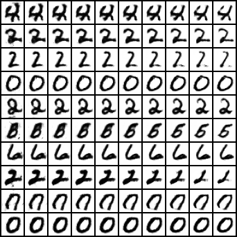

Flat Metric Minimization
================
This repo contains a minimal PyTorch implementation to reproduce Fig. 6 and Fig. 7 from the paper:

*Flat Metric Minimization with Applications in Generative Modeling* (Thomas Möllenhoff, Daniel Cremers; ICML 2019).

Notes
-------------------
- We have tested the code on: Ubuntu 16.04; Python 3.7.1; PyTorch 1.0.0
- Running the MNIST example (demo_mnist.py) will first download the MNIST dataset into the data/ folder
- The results will be saved in results/2d (for demo_2d.py) and results/mnist (for demo_mnist.py)

Demo outputs
-------------------

```
python demo_2d.py --k 0
```

 

```
python demo_2d.py --k 1
```

 


```
python demo_mnist.py 
```

 


Publication
-------------------
```
@article{flatgan,
    title = {Flat Metric Minimization with Applications in Generative Modeling},
    author={Thomas Möllenhoff, Daniel Cremers},
    journal={International Conference on Machine Learning},
    year={2019},
}
```
